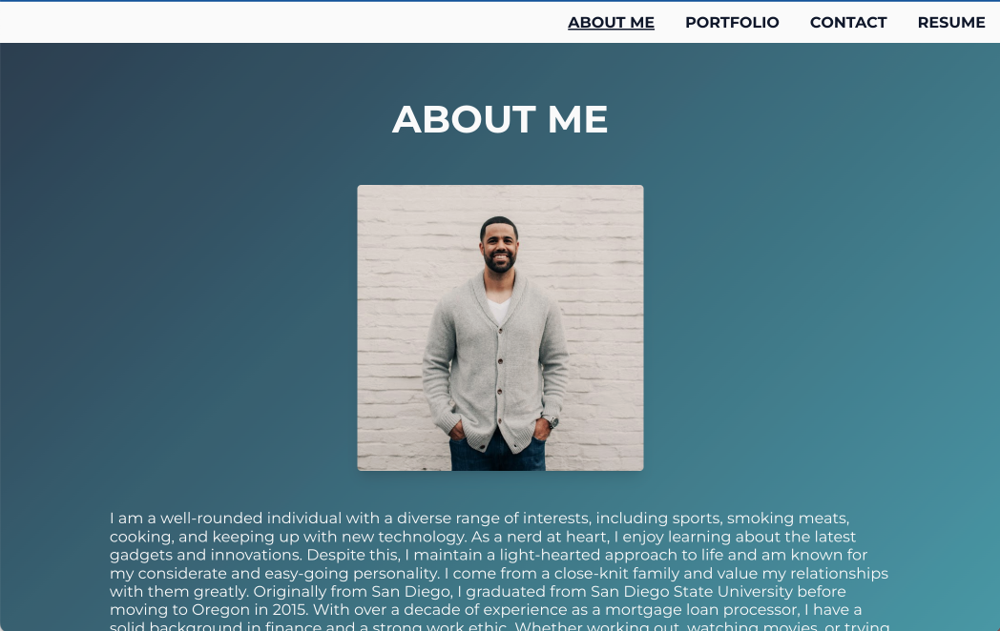

# Portfolio Redux

This project is a portfolio website created with React and Tailwind CSS. It serves as a space to showcase my projects and abilities, as well as to provide a way for people to contact me.

## Live Demo

To view the deployed application, please click [here](https://pchandler858.github.io/portfolio-redux/).

## Installation

To get started with the project, clone the repository and install the dependencies:

```
git clone https://github.com/pchandler858/portfolio-redux
cd portfolio-website
npm install
```

## Usage

To start the project, run the following command:

`npm start`

Your application should now be running on `localhost:3000`.

## Contributing

Contributions are welcome. If you would like to contribute to this project, please create a pull request.

## Questions

If you have any questions about the repo, please contact me:

- Email: [pchandler858@gmail.com](mailto:your.email@example.com)
- GitHub: [@pchandler858](https://github.com/pchandler858)

## Screenshot


